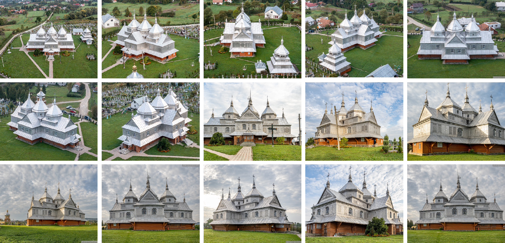
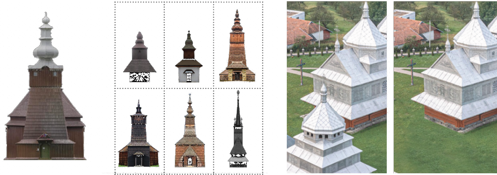
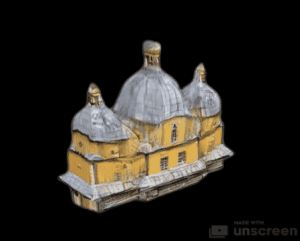
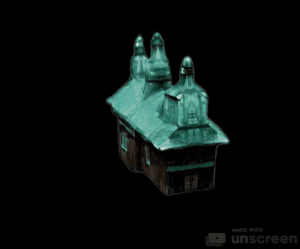
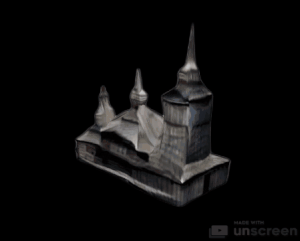
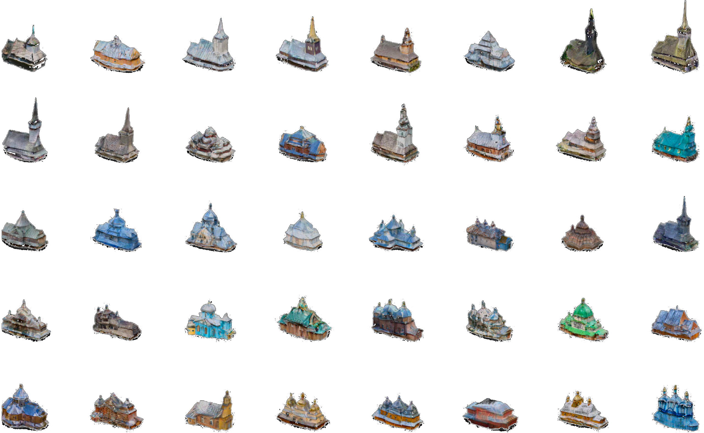

# Creating Datasets of 3D Buildings from 2D Images

## About 

This study demonstrates a method to create large databases of 3-D buildings in any style using the recently released [Neural Reflectance Surfaces](https://jasonyzhang.com/ners/) (NeRS) approach. Developed at Carnegie Melon University in 2021 by [Jason Zhang](https://jasonyzhang.com/) Et. al, NeRS is an algorithmic method that converts in-the-wild, sparse-view image datasets of objects into geometrically and texturally accurate water-tight reconstructions.  Given the increasing demand for and general scarcity of 3-D data for deep learning research and applications, this approach provides an excellent means of meeting this demand as applied to objects that have been only sparsely photographed.


## Project Page

An expanded description of this model implimentation can be found on its project page here:

[www.michaelhasey.com/deep-vernacular-summary](www.michaelhasey.com/deep-vernacular-summary)

## Table of Contents

- [Dataset](#Dataset)
- [Approach](#Approach)
- [Implementation](#Implementation)
- [Performance](#Performance)
- [References](#References)
- [Citation](#Citation)

<br>

## Why NeRS?

In ideal conditions, building images can be easily reconstructed into highly accurate 3D representations by using photograpmmetry software like Bently System’s “ContextCapture” or Epic Game’s “Reality Capture” programs. However, these systems, like many others, require hundreds or thousands of images of a target object to reconstruct it in 3D. However, there are many situations where collecting or taking hundreds of images of a single object is impossible. For example, when the target building is innaccesible, if it no longer exists, or when there are too many objects to realistically capture by a single or even group of people.  For instance, if wanting to reconstruct hundreds of buildings in 3-D. In this situation, NeRS provides an excellent solution to reconstruct 3D building representations from as few as 6-8 photographs per object. 

<br>

## Case Study

As case study, and as the first demonstrations of the NeRS process being applied to architecture, we demonstrate the creation of a custom dataset of 331 3-D digital models of wooden churches from Carpathian Mountain regions in and around Ukraine.  Given that no more than a dozen 3-D models of these buildings exist, the Carpathian Wooden Churches of this region are an ideal candidate for this demonstration.  We then showcase a method to augment the dataset from 331 buildings to 5,627 buildings to satisfy the training dataset requirements of typical deep learning models.


<br>

## Approach

### A 4 Step Pipeline

The following diagram and accompanying description outlines our four-step pipeline for creating large training datasets of 3D buildings from sparse imagery for use in DL-based work.  

<br>


#### Step 1: Image Search
1. Image Search:   Online search for images of building to be used in reconstruction.  [Archi_Base](https://github.com/michaelhasey/Archi_Base) can be used to expedite this process. 

#### Step 2: NeRS Preprocessing
2. Image Selection:   Final images showcasing all exterior sides of each church
3. Image Editing:   Remove occlusions, correct perspective distortions, and compensate for missing images
4. Image Masking:  Creating image masks around the outline of the church
5. Parameter Setting:    Estimating image angles between the camera and the church
6. Template Shape Estimation:   Estimating the general dimensions of the churches (length, width, and height)

#### Step 3: NeRS 3-D Reconstruction 
7. NeRS Reconstruction:   Automated 3-D reconstruction of all buildings into high quality detailed mesh objects.

#### Step 4: Data Augmentation & Formatting
8. Data Augmentation:   Augmenting the data from 331 churches to 5627 models
9. Data Formatting:   converting the models to the appropriate format for DL Model Input (SDF voxel format for this example).

<br>

### Step 1: Image Search

<br>

#### 1) Image Search

The wooden churches used in this research reside within the mountainous, foothill and water-shed region of the Carpathian Mountain region of Central Europe.  In order to build the dataset, digital images of over 400 churches were manually searched for and collected over a one month period.  In total, over 10,000 images were collected, representing 409 unique churches from the central Carpathian Mountain region showcasing a wide range of distinct styles and sub-styles.  Images were acquired from a number of online resoures, including, but not limited to, Google Earth, various academics and domain experts, various blogs, and multiple image repositories that specialize in historic architecture of this region.



<br>

### Step 2: NeRS Preprocessing

<br>

#### 2) Image Selection

Images for each church needed to be carefully pre-processed and  prepared for 3-D reconstruction. First, the final images required for the 3D reconstruction process need to be selected. Then, some images were altered in order to ensure their associated church was accurately reconstructed in 3D. For example, images occasionally had to be manually edited or constructed to provide the front or rear elevations.



Next, object masks needed to be provided for each individual image. Then, both the horizontal and vertical camera angle between the camera and the church for each image was manually recorded to a JSON file. Next, a custom script was created to automatically duplicate images and horizontally flip them to represent the other side of the building. Finally, the dimensions of a shape template corresponding to the estimated approximate size of each church must be determined 


<br>

#### 3) Image Editing

Once all images have been preprocessed and their corresponding JSON files complete, the final stage of the reconstruction pipeline (Figure 113) was reached and each church was reconstructed from the images as a high-quality detailed mesh object using the NeRS algorithm.  To reconstruct each church a remote computing cluster containing 4 GPUs (NVidia GeForce GTX Titan X with 12 GB of VRAM) was used to expedite this process. Once completed, the reconstruction quality of each church was manually inspected. Out of the original 409 churches, 96 could not be recon-structed due to insufficient imagery.


The dataset of reconstructed churches includes 313 individual buildings (Figure 115, 116). The dataset were then automatically augmented from 313 buildings to 5,627 buildings using an algorithm that made slightly different copies of each building through a series of random rotation and scaling transformations. 







<br>



<br>

### Step 4: Augment Dataset using Synthetic Data

In order to sufficiently train the DL network and extract a reasonable latent space distribution, where latent space is a representation of abstracted data where similar data points are clustered closer to-gether, the dataset needed to be augmented from 313 buildings to 5,627 buildings. Data augmenta-tion is common technique if the dataset is insufficiently large to train a DL-model and helps prevent overfitting [32]. Overfitting is when a model begins to memorize hyper-specific features of the data, rather than more useful general features of the data that might help better describe it as a whole. To avoid overfitting, the dataset was augmented to be 17X its original size by making 17 copies of each building, with each copy being slightly different from the next through a series of transformations such as rotation and randomly scaling. To expedite this process, a custom script and data pipeline was created in Grasshopper, a parametric design software used to create and manipulate 3D geometry. 


## References

This project was completed as part of Carnegie Melon University's Learning Based Image Synthesis course 16 726 taught by Jun-Yan Zhu in Spring of 2021.

## Citation

If you find this project useful in your research, please consider citing:

``` 
@misc{mhasey2021,
    title={Image Blending Tool},
    author={Michael Hasey},
    year={2021},
}
```
